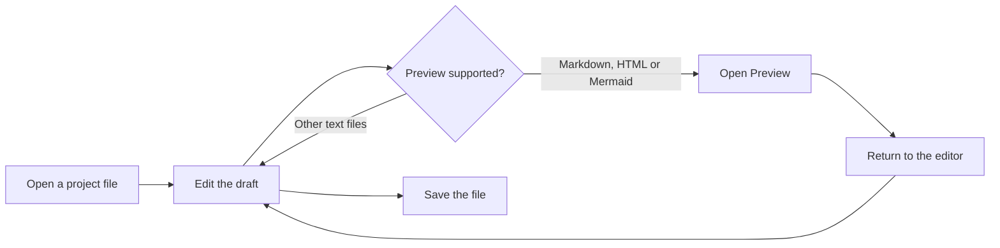
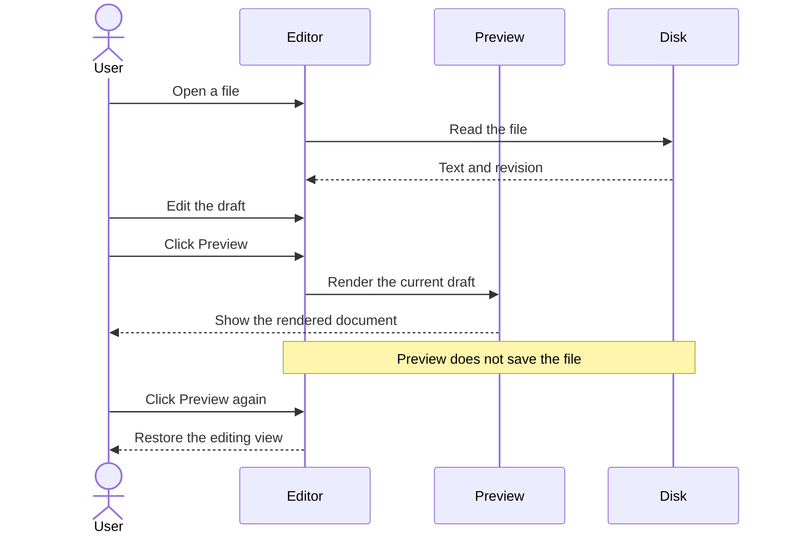
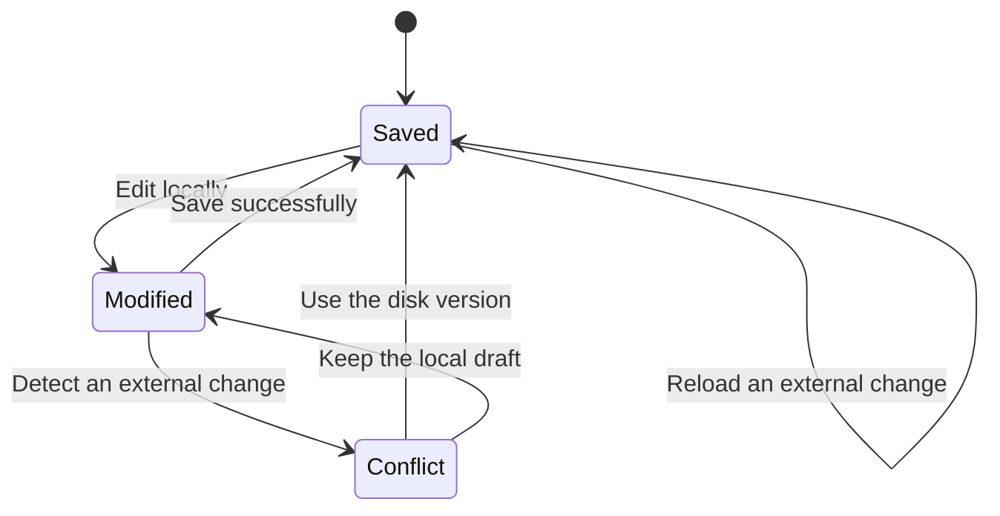

# Mermaid Preview Demo

Open this file in **File Editor**, then click **Preview** to render the diagrams.
Edit a label and reopen the preview to see your unsaved changes.

## Editing workflow

## Draft preview

## Handling external changes

## Markdown formatting

The preview should also render **bold text**, *emphasis*, `inline code`, and tables.

| Format | Expected preview |
| --- | --- |
| Markdown | Formatted text and diagrams |
| HTML | Static content with embedded styles |
| Mermaid | A standalone diagram |

> Try both light and dark themes, and resize the pane to check the diagrams.
